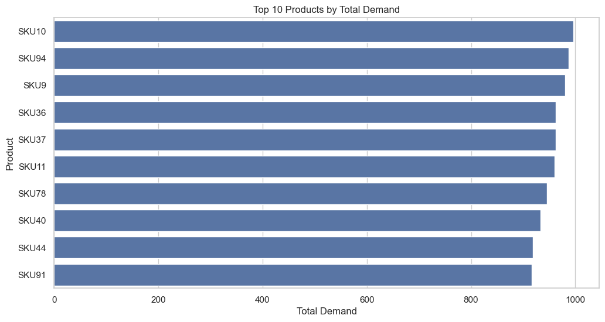
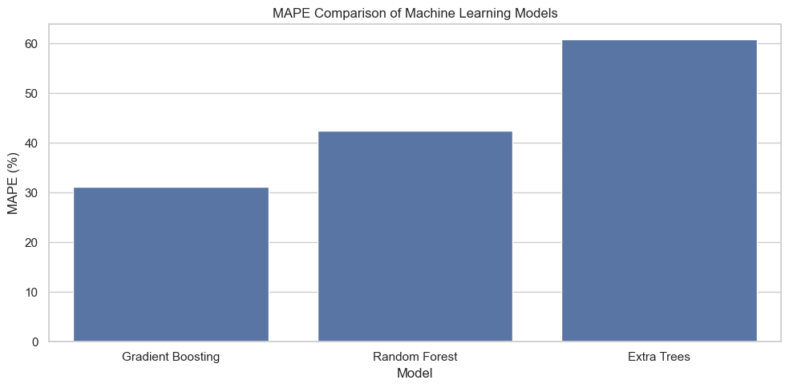
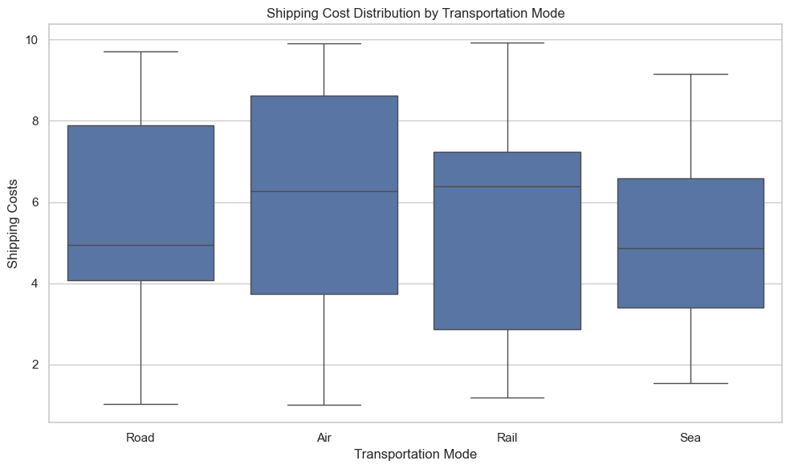
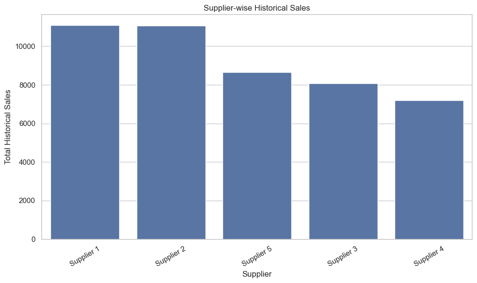

# supply-chain-demand-forecasting-ml
🚀 Supply Chain Demand Forecasting & Optimization

End-to-End Machine Learning Project for Predicting Demand and Optimizing Supply Chain Decisions

📌 Overview

This project presents a complete data analytics and machine learning pipeline designed to analyze supply chain data and forecast product demand. It enables businesses to make data-driven decisions for inventory planning, supplier management, and logistics optimization.

The project integrates:

Data preprocessing & feature engineering

Exploratory Data Analysis (EDA)

Machine Learning modeling

Business insights & visualization

🧠 Business Problem

Modern supply chains face critical challenges:

❌ Unpredictable demand fluctuations

❌ Overstocking or stockouts

❌ Inefficient supplier utilization

❌ High logistics and operational costs

Without accurate forecasting, organizations suffer from:

Revenue loss

Increased holding costs

Poor customer satisfaction

👉 This project solves these issues by building a predictive demand system.

🎯 Objective

Analyze historical supply chain data

Identify demand patterns and trends

Build ML models to forecast demand

Evaluate model performance using key metrics

Generate actionable business insights

🎯 Project Goals

📊 Develop accurate demand forecasting model

📉 Minimize prediction error (RMSE, MAE)

🔍 Understand key demand drivers

⚙️ Improve supply chain efficiency

📦 Support inventory optimization decisions

⚙️ Tech Stack

Category	Tools Used

Programming	Python

Data Analysis	Pandas, NumPy

Visualization	Matplotlib, Seaborn

Machine Learning	Scikit-learn

Model Saving	Joblib

Development	Jupyter Notebook, VS Code

📊 Project Dataset

Due to large file size, the dataset is hosted on Google Drive.

🔗 Download Dataset:
- [Supply_Chain_Management_Dataset]((https://drive.google.com/drive/folders/1-MClTKVzE_TxXEYBGnR-NMQg8iHAH2ET?usp=drive_link))

📌 Note:
Download the dataset and place it inside the `data/` folder before running the notebook.

🔄 Project Workflow

Data Collection → Data Cleaning → Feature Engineering → EDA → Model Training → Evaluation → Insights

📁 Project Structure

supply-chain-demand-forecasting-ML/

│
├── notebooks/

│   └── Supply_Chain_Demand_Forecasting.ipynb

│
├── screenshots/

│   ├── demand_trend.png

│   ├── model_performance.png

│   ├── shipping_cost.png

|   ├── supplier_analysis.png

├── sql/

│   └── supply_chain_management.sql

├── README.md

├──Supply_Chain_Demand_Forecasting_Presentation.pdf

├── requirements.txt

📊 Exploratory Data Analysis (EDA)

Key analysis performed:

📈 Sales trend over time

📦 Product-wise demand distribution

🚚 Shipping cost analysis by transport mode

🏭 Supplier performance comparison

📊 Visual Results

📈 Product-wise demand distribution

📈 Model Performance Comparison

📉 Shipping cost analysis by transport mode

📊 Supplier performance comparison

🔍 Key Insights

Demand shows high volatility with frequent spikes

Top suppliers contribute major share of total sales

Certain transportation modes show higher cost variability

Demand influenced by time, supplier, and logistics factors

🤖 Machine Learning Models

Models used:

Random Forest Regressor

Gradient Boosting Regressor

Neural Network (MLP Regressor)

📈 Evaluation Metrics

RMSE (Root Mean Squared Error)

MAE (Mean Absolute Error)

R² Score

👉 Best model selected based on lowest error and highest accuracy.

📊 Model Performance

Model successfully captured demand patterns

Predictions closely aligned with actual values

Reliable for real-world forecasting applications

💼 Business Insights

📦 Demand forecasting helps prevent stockouts and overstock

🚚 Optimizing transport mode reduces logistics cost

🏭 Supplier analysis improves sourcing strategy

📊 Data-driven decisions increase operational efficiency

📈 Business Impact

Improved inventory planning

Reduced operational costs

Better supplier management

Enhanced decision-making capability

⚠️ Project Limitations

Limited dataset scope

External factors (market trends, economy) not included

Model performance depends on data quality

No real-time data integration

🔮 Future Scope

Real-time demand forecasting system

Integration with Power BI dashboard

Advanced models (XGBoost, LSTM)

Deployment using Streamlit / Flask

Automated supply chain optimization

▶️ How to Run the Project

1️⃣ Clone Repository

git clone https://github.com/your-username/supply-chain-demand-forecasting.git

cd supply-chain-demand-forecasting

📎 Project Files

📘 Jupyter Notebook: notebooks/Supply_Chain_Demand_Forecasting.ipynb

📊 Dataset: data/supply_chain_data.csv

📑 Presentation: Supply_Chain_Demand_Forecasting_Presentation.pdf

🧠 Skills Demonstrated

Data Cleaning & Preprocessing

Exploratory Data Analysis

Machine Learning Modeling

Model Evaluation & Optimization

Business Insight Generation

End-to-End Project Development

🏁 Conclusion

This project demonstrates how machine learning can transform raw supply chain data into actionable insights and accurate demand forecasts. It highlights the importance of data-driven strategies in improving efficiency, reducing costs, and enhancing decision-making in modern supply chain systems.
